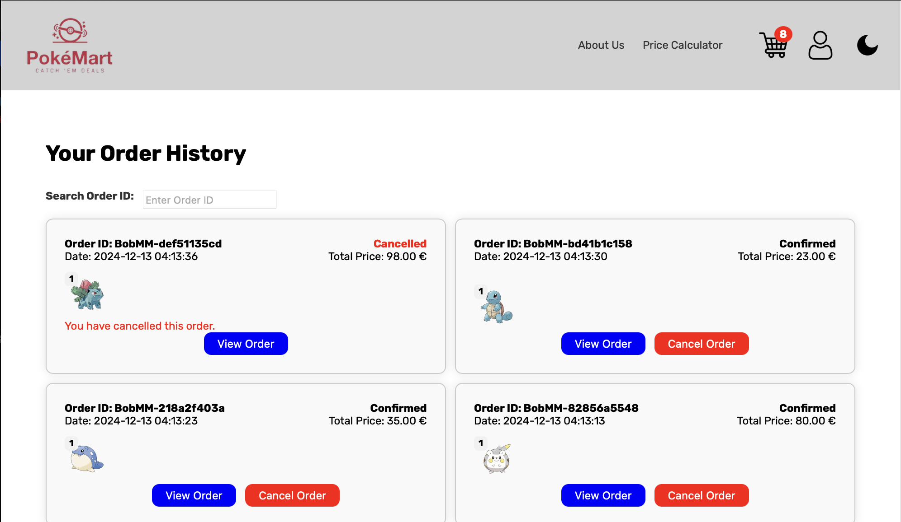

# Pokémon Webshop (Pokémart)

The **Pokémart** is an e-commerce platform for Pokémon enthusiasts, offering a variety of Pokémon-themed merchandise and collectibles. Designed for both casual and dedicated fans, it provides a seamless shopping experience with features like a dynamic cart, order tracking, and fun Pokémon-themed interactions.

## Table of Contents

- [Key Features](#key-features)
- [Technical Implementation](#technical-implementation)
- [Setup and Other Information](#setup-and-other-information)
- [Screenshots](#screenshots)
- [Source](#source)

## Key Features

### Dynamic Shopping Cart
- Real-time updates on item quantities and prices.
- Personalized carts for users and temporary carts for guests.
- Automatic transfer of guest carts upon login.

### Order Management
- **For Customers**: Track order status and cancel unshipped orders.
- **For Admins**: Manage orders, update statuses, and block users.

### Discounts & Interactive Features
- Automatic discounts:
    - 10% for the 10th purchase.
    - 20% for the 20th purchase.
- Product search, filtering, and currency conversion.
- Randomly displayed Pokémon-type emojis for a fun experience.
- Mobile-friendly design with a responsive layout and dark mode.

## Technical Implementation
- **Frontend**: HTML, CSS, JavaScript for design and interactivity.
- **Backend**: PHP for dynamic content loading and server-side logic.
- **Data Storage**: JSON files instead of a database to store user, product, and order data.

## Setup and Other Information
- [Set Up](setup.md)
- [Changelog](CHANGELOG.md)

---

## Screenshots

#### Homepage

#### Products

#### Order History

#### Shopping Cart

---

## Source
This webshop is inspired by the official Pokémon Pokedex, which can be found at [Pokémon Pokedex](https://www.pokemon.com/us/pokedex).